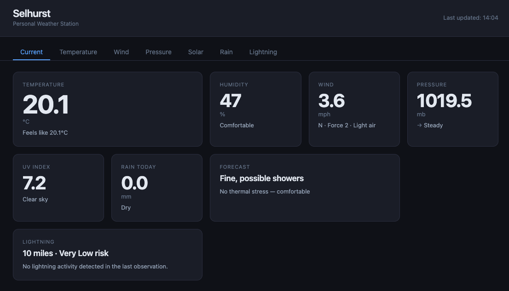

# Tempest Dashboard

A dark-themed web dashboard for the [WeatherFlow Tempest](https://weatherflow.com/tempest-weather-system/) 
personal weather station, built with Flask and Chart.js.

Reads from the SQLite database populated by [tempest-logger](https://github.com/stetho/tempest-logger),
enriches the raw data with calculations from [tempest-analytics](https://github.com/stetho/tempest-analytics),
and presents everything in a tabbed, auto-refreshing interface.



## Features

- **Live conditions** — temperature, humidity, wind, pressure, UV, rain and lightning
  updated every 5 minutes
- **7 tabbed views** — Current, Temperature, Wind, Pressure, Solar, Rain, Lightning
- **24-hour charts** — temperature, humidity, wind speed, pressure and solar radiation
- **Derived analytics** — Zambretti forecast, Beaufort scale, clear sky index, frost
  risk, thermal comfort, gust factor, antecedent rainfall index and more
- **Lightning safety** — real-time risk level and plain-English safety advice
- **Responsive** — works on mobile and desktop
- **Dark theme** — easy on the eyes at any time of day

## Screenshots


## Requirements

- Python 3.12+
- A running [tempest-logger](https://github.com/stetho/tempest-logger) instance
  with data in its SQLite database
- Docker and Docker Compose (for deployment)


## Local Development

**1. Clone the repository**

```bash
git clone https://github.com/stetho/tempest-dashboard.git
cd tempest-dashboard
```

**2. Create a virtual environment**

```bash
python -m venv .venv
source .venv/bin/activate
pip install -r requirements.txt
```

**3. Install the analytics library**

```bash
pip install -e ../tempest-analytics
```

**4. Copy the database from your logger**

The dashboard expects the logger's SQLite database at:
`../tempest-logger/data/tempest.db`

For local development, copy it from your server:

```bash
scp user@yourserver:/data/tempest-logger/data/tempest.db \
    ../tempest-logger/data/tempest.db
```

**5. Run the development server**

```bash
python app.py
```

Open [http://127.0.0.1:5000](http://127.0.0.1:5000) in your browser.

## Deployment

The dashboard runs as a Docker container alongside the logger on the same host,
sharing the logger's database via a named volume.

**1. Clone onto your server**

```bash
git clone https://github.com/stetho/tempest-dashboard.git
cd tempest-dashboard
```

**2. Build and start**

```bash
docker compose up -d --build
```

The dashboard will be available on port 5000. Put it behind a reverse proxy
(nginx, Caddy, or SWAG) for SSL and a proper subdomain.

## Project Structure

- `app.py` — Flask app, routes and analytics integration
- `db.py` — Database query functions
- `templates/index.html` — Main dashboard template
- `static/css/dashboard.css` — Dark theme styles
- `static/js/dashboard.js` — Tab switching, data fetching and charts
- `Dockerfile`
- `docker-compose.yml`
- `docs/screenshot.png`

## API Endpoints

The dashboard exposes a simple JSON API:

| Endpoint | Description |
|---|---|
| `GET /api/current` | Latest observation enriched with all analytics |
| `GET /api/history/24h` | Last 24 hours of observations for charting |
| `GET /api/rain/summary` | Spell tracker and antecedent rainfall index |

## Part of a Larger Project

| Phase | Repo | Description | Status |
|---|---|---|---|
| 1 | `tempest-logger` | Data collection service | ✅ Complete |
| 2 | `tempest-analytics` | Derived calculations library | ✅ Complete |
| 3 | `tempest-dashboard` | Web visualisation | ✅ Complete |
| 4 | `tempest-camera` | Camera integration | ✅ Complete |
| 5 | `tempest-alerts` | Threshold alerting service (Go) | 📋 Planned |

## License

MIT
